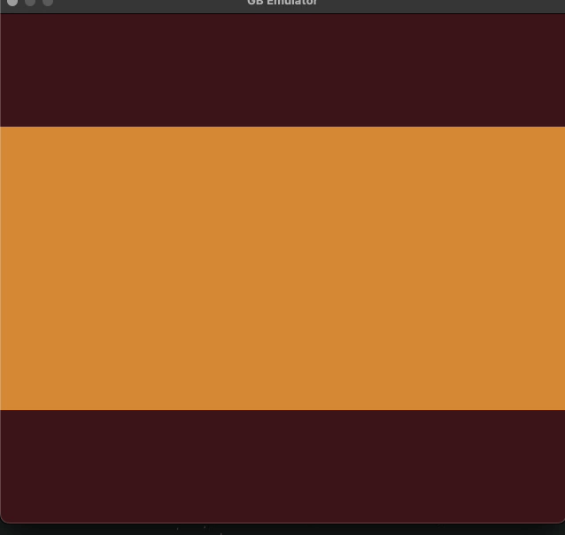

# gb-emulator
Another gameboy emulator written in rust. Built for eduactional purposes, not intended to be 
super robust and accurate. Example uses [rust_minifb](https://github.com/emoon/rust_minifb) 
for window display. Tested on macos but theoretically runs cross platform. 




## Features
The emulator is still a WIP but currently has the following:

- Working CPU (passes blargg cpu_instrs and cpu_timing).
- Working PPU with scanline renderer.
- Joypad provides a generic way to 'press' and 'release' buttons by calling functions. 
- Support for multiple ROM types, currently: NoMBC, MBC1 & MBC3.
- 'emulator_core' kept device agnostic and provides access to indivual emulator components.
- Multi-platform runnable example which uses minifb and supports keyboard input.

## Limitations
- Currently does not have sound support,
- Does not support all MBC types.
- Only M-cycle accuracy, not designed for sub-instruction level accuracy (fails 
blargg memory test and some of the obscure mooneye timer tests).
- No Super Game Boy or Game Boy colour support.

## Running

To run locally: 

```
cargo run
```

To run unit and acceptance tests:
```
cargo test
```

To build in release mode:

```
cargo build --release
```

